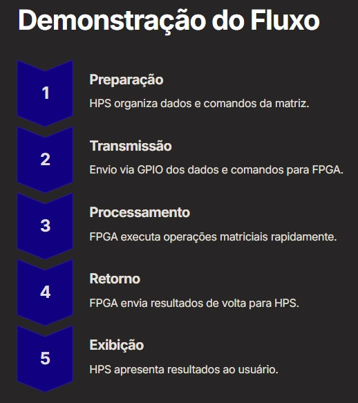
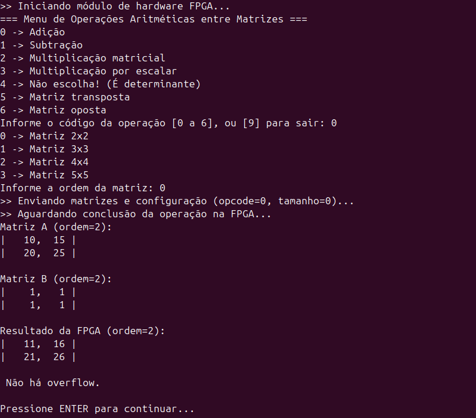
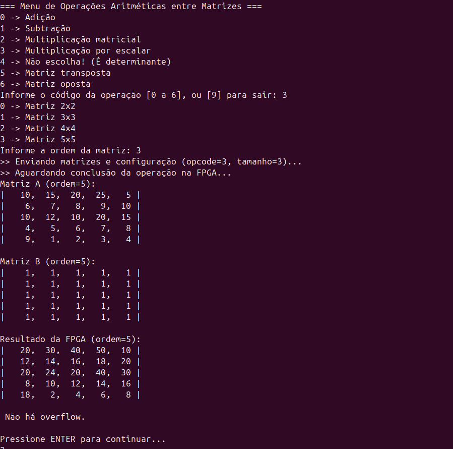
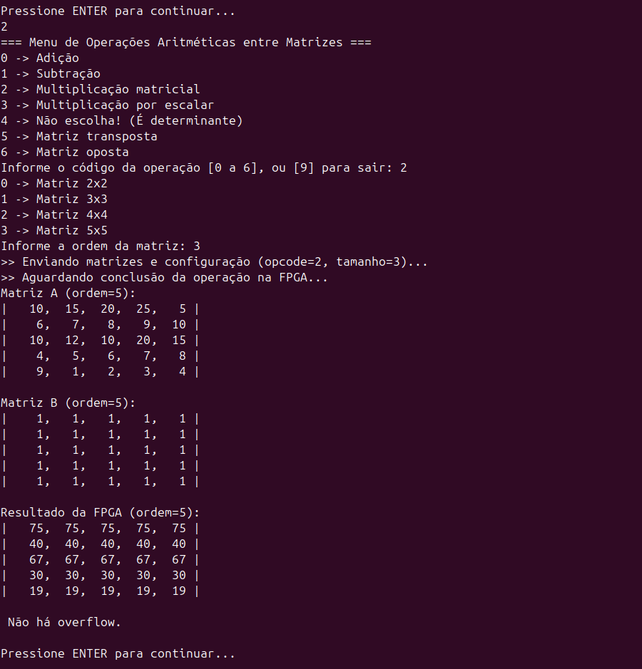
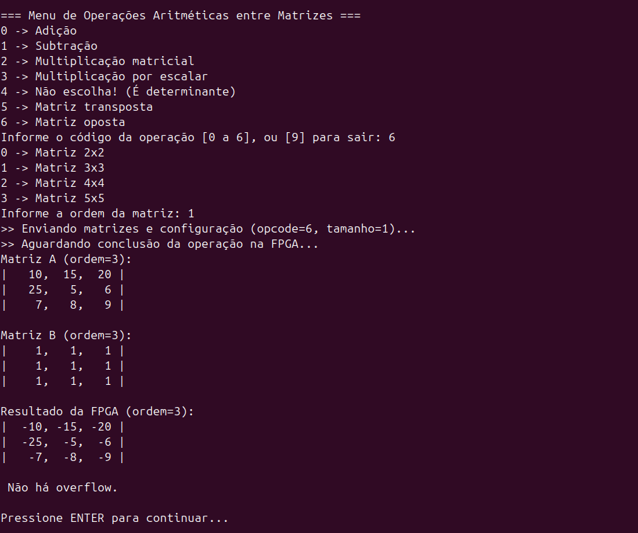
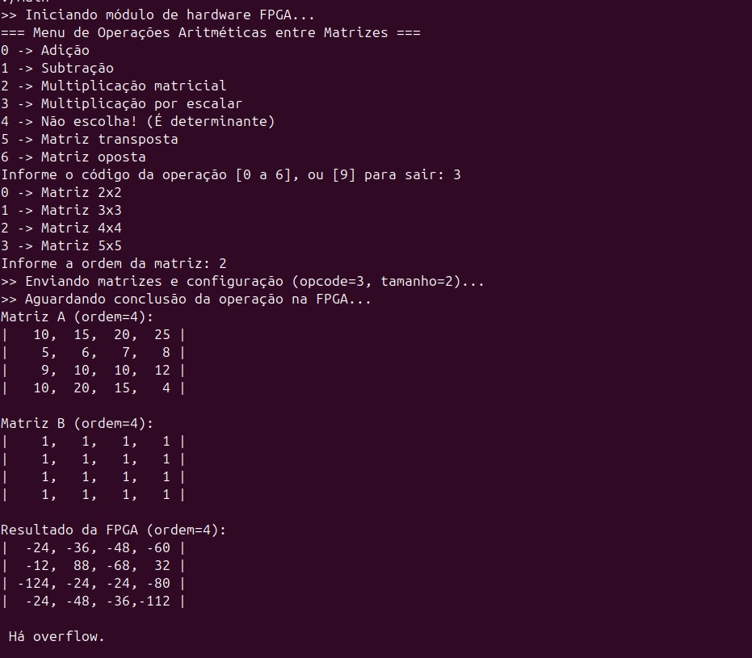

<div align="center">
  <h1> Desenvolvimento de biblioteca Assembly para utilização em coprocessador aritmético </h1>
  <h3> Universidade Estadual de Feira de Santana </h3>
  <h3> TEC499 (TP04) - MI Sistemas Digitais </h3>
  <h4> Gabriel Vitor Nogueira da Silva, Luana Pedreira Oliveira e Lucca de Almeida Hora Coutinho </h4>
</div>

## Introdução

<p align="justify">
Atualmente, diversas áreas da computação, como visão computacional, aprendizado de máquina, criptografia e simulações científicas, demandam grande capacidade de processamento, especialmente em operações envolvendo multiplicação de matrizes. A utilização de coprocessadores dedicados se apresenta como uma solução eficiente para acelerar essas operações, proporcionando melhorias significativas em desempenho e eficiência energética.
</p>

<p align="justify">
Neste contexto, foi desenvolvido anteriormente um coprocessador especializado na multiplicação matricial utilizando a plataforma DE1-SoC, que combina um processador ARM com um FPGA. Esse coprocessador visa atender aplicações que exigem alto desempenho em operações matriciais.	
</p>

<p align="justify">
Dando continuidade a esse desenvolvimento, o presente trabalho tem como objetivo a criação de uma biblioteca em linguagem Assembly para arquitetura ARM, que permite a interação eficiente entre o processador e o coprocessador implementado no FPGA. A biblioteca abstrai detalhes de baixo nível, facilitando a utilização das funções de multiplicação matricial por outras aplicações de software.
</p>

## Arquitetura do Sistema

<p align="justify">
A comunicação entre o Hardware (FPGA) e o Software (HPS - Hard Processor System) ocorre por meio de uma interface de barramento disponibilizada no sistema embarcado, especificamente através dos barramentos HPS-to-FPGA (H2F) e FPGA-to-HPS (F2H). Esta interface permite a troca de dados entre o coprocessador de multiplicação matricial e o processador ARM que executa o sistema Linux.
</p>

<p align="justify">
A respeito dos componentes Principais da Arquitetura, o processador ARM (HPS) executa o Linux, controla a aplicação e chama rotinas da biblioteca Assembly que interagem com o coprocessador. O coprocessador de multiplicação matricial, implementado na FPGA, é formado pela Unidade de Controle, que gerencia o fluxo de dados e sinais, e pela Interface de Dados, que comunica com o ARM via sinais DATA_IN e DATA_OUT.
</p>

<p align="justify">
A comunicação entre FPGA e HPS ocorre por sinais configurados na plataforma Qsys/Platform Designer do software Quartus II Prime Lite Edition: data_in_external_connection_export e data_out_external_connection_export. O sistema inclui detectores de borda para sinais de reset (frio, quente e debug) e o clock principal de 50 MHz (CLOCK_50).
</p>

<p align="justify">
A respeito do fluxo de funcionamento, o processador ARM executa uma aplicação Linux que utiliza uma biblioteca em Assembly desenvolvida para o projeto. Essa biblioteca envia comandos e dados para a FPGA por meio da interface de comunicação chamada DATA_IN.
</p>

<p align="justify">
Dentro da FPGA, a Unidade de Controle recebe esses dados, realiza o processamento necessário e executa a multiplicação matricial. Após o cálculo, os resultados são disponibilizados na linha DATA_OUT. Em suma, o processador ARM lê os resultados enviados pela FPGA e continua o processamento da aplicação.
</p>

<p align="center">
    
    <br/>
    <b>Figura 1.</b> Representação do fluxo. <b>Fonte:</b> Os autores.
</p>

## Hardwares Utilizados

<p align="justify">
O projeto utilizou a plataforma DE1-SoC da Terasic, composta por um FPGA Altera Cyclone V e um processador ARM Cortex-A9 dual-core. O FPGA possui 110 mil elementos lógicos e memória SDRAM dedicada, enquanto o processador conta com 1 GB de DDR3 e roda Linux embarcado. 
</p>

<p align="justify">
A placa dispõe de interfaces como GPIOs, LEDs, switches, displays de 7 segmentos, HDMI, VGA, USB, Ethernet e UART. A comunicação entre o processador e o FPGA é feita pelo barramento Lightweight HPS-to-FPGA bridge, que permite acesso direto aos registradores da FPGA via endereços de memória. O clock principal do FPGA é de 50 MHz, e o sistema utiliza cartão MicroSD para boot do Linux e armazenamento de dados.
</p>


## Softwares Utilizados

<p align="justify">
O sistema operacional Linux embarcado é executado no processador HPS da DE1-SoC. Para o desenvolvimento cruzado, utiliza-se Linux Ubuntu no host, suportando a arquitetura ARMv7.
</p>

<p align="justify">
O desenvolvimento do hardware é realizado com as ferramentas Intel Quartus II Prime Lite Edition e Platform Designer, que permitem a síntese dos circuitos e a conexão dos módulos FPGA ao HPS. A compilação do software conta com o compilador GCC para ARM, o montador GNU Assembler e a ferramenta Make, que automatiza o processo de compilação.	
</p>

<p align="justify">
A comunicação entre software e hardware ocorre por meio de chamadas de sistema Linux (open, mmap2, close e munmap) para mapear os registradores da FPGA. O driver /dev/mem permite o acesso direto à memória física. Para controle de versão e gerenciamento do código, utiliza-se Git, com os repositórios hospedados no GitHub.
</p>


## Biblioteca Assembly

<p align="justify">
A biblioteca Assembly desenvolvida tem como objetivo fornecer uma interface de comunicação entre o processador ARM (HPS) e o coprocessador de multiplicação matricial implementado no FPGA da plataforma DE1-SoC. Essa interface permite que o software em execução no ARM envie dados para o hardware, controle sua operação e receba os resultados processados.
</p>

<p align="justify">
Ela foi implementada inteiramente em linguagem Assembly para arquitetura ARM, otimizando tanto o acesso direto à memória mapeada do FPGA quanto o controle dos sinais de handshaking (sincronização) necessários. Ela é composta por dois arquivos: header.c e assembly.s.
</p>

<p align="justify">
O arquivo header.h é o cabeçalho em C, que define as estruturas, constantes e protótipos das funções da biblioteca. Já o arquivo assembly.s possui a implementação das seguintes funções em assembly:
</p>

 | Função        | Descrição                                                                                                                                                                       |
|----------------|---------------------------------------------------------------------------------------------------------------------------------------------------------------------------------|
| `begin_hw()`   | Inicializa o acesso ao hardware: abre `/dev/mem`, faz o mapeamento da região LW Bridge e configura ponteiros para os registradores de entrada e saída da FPGA. Retorna `HW_SUCCESS` ou `HW_INIT_FAIL`. |
| `end_hw()`     | Finaliza o acesso ao hardware, desfaz o mapeamento e fecha o descritor de arquivo.                                                                                             |
| `send_data(p)` | Envia os parâmetros para o coprocessador, incluindo os dados das matrizes, opcode, tamanho e escalar. Gera os pulsos de reset e start, além de realizar a sincronização de envio dos dados. |
| `read_results()`| Realiza a leitura dos resultados processados pela FPGA. Além dos dados, captura também um sinal de overflow caso tenha ocorrido.                                              |


<p align="center"><b>Tabela 1.</b> Funções em Assembly. Fonte: Os autores.</p>

### Código em C
<p align="justify">
O código desenvolvido em linguagem C - main.c - tem como objetivo servir de interface entre o usuário e o coprocessador implementado na FPGA, permitindo a execução de diversas operações aritméticas entre matrizes. Através de um menu interativo exibido no terminal, o usuário pode selecionar a operação desejada e a ordem da matriz (variando de 2x2 até 5x5). As matrizes A e B são pré-definidas no código para facilitar os testes, mas há possibilidade de mudanças na implementação para permitir entradas dinâmicas.
</p>

<p align="justify">
O programa realiza validações dos parâmetros inseridos utilizando a função validate_operation(), garantindo que apenas códigos de operação e tamanhos válidos sejam processados. Em seguida, os dados são empacotados em uma estrutura Params e enviados para a FPGA por meio da função send_data(). Após o processamento no hardware, a função read_results() é responsável por recuperar os dados processados e verificar a ocorrência de overflow. Para exibição dos resultados, o código implementa a função print_matrix(), que organiza visualmente as matrizes no terminal, com alinhamento e delimitação por colunas e linhas. Por fim, o código gerencia toda a inicialização e finalização da comunicação com o hardware através das funções begin_hw() e end_hw(), respectivamente. O menu contém um loop que permite a realização de múltiplas operações de forma contínua, sem a necessidade de inicializar o acesso ao hardware toda vez que for realizar uma operação.

</p>


## Preparação do Ambiente de Desenvolvimento

<p align="justify">
	
</p>

### Descrição de Instalação

<p align="justify">
É necessário utilizar o sistema operacional Linux, de qualquer distribuição. Para a instalação do **Quartus II Prime Lite Edition**, siga as seguintes etapas:

- Acesse o site oficial da Intel FPGA: [https://fpgasoftware.intel.com/](https://fpgasoftware.intel.com/)
- Selecione a versão desejada.
- Escolha **"Quartus Prime Lite Edition (Linux)"**.
- Baixe o instalador `.tar` ou `.run`.
</p>

### Configuração de Ambiente

<p align="justify">
Após clonar o repositório, abra um projeto no Quartus através da opção **Open Project** e selecione o arquivo `soc_system.qpf`.

Em seguida, compile o projeto e envie para a placa **DE1-SoC** através da opção **"Programmer"**.
</p>

### Execução

<p align="justify">
Existe um arquivo `Makefile` no projeto, onde será possível compilar de uma forma mais rápida. Utilize os seguintes comandos no terminal Linux para executar:

```bash
sudo make
sudo make run
```
</p>

## Testes de Funcionamento do Sistema

<p align="justify">
Os testes de funcionamento foram realizados por meio de um programa principal desenvolvido em linguagem C. Esse programa conta com um menu interativo em loop, que permite ao usuário selecionar diferentes operações aritméticas (como multiplicação, soma e subtração) e definir o tamanho das matrizes utilizadas. As operações são realizadas pelo coprocessador escrito em Verilog na FPGA, e por isso retornam rapidamente. Foram testadas todas as combinações de operação e tamanhos de matrizes, limitadas de 2x2 até 5x5.
</p> 

<p align="justify">
Os elementos das matrizes A e B são preenchidos diretamente no código-fonte em C, bem como o valor de escalar, evitando a necessidade de entrada manual e permitindo testes mais rápidos e padronizados. Os testes incluem também a verificação da ocorrência de overflow, com a biblioteca sendo capaz de identificar quando os resultados ultrapassam o limite de representação da lógica utilizada. Dessa forma, foi possível validar o correto funcionamento do sistema em diferentes cenários, assegurando que a comunicação entre o processador ARM e a FPGA ocorre conforme esperado.
</p> 

<p align="center">
    
    <br/>
    <b>Figura 2.</b> Testagem do menu interativo do código em C. <b>Fonte:</b> Os autores.
</p>

<p align="center">
    
    <br/>
    <b>Figura 3.</b> Testagem com matrizes 5x5 com multiplicador escalar pré-definido em 2. <b>Fonte:</b> Os autores.
</p>

<p align="center">
    
    <br/>
    <b>Figura 4.</b> Testagem com matrizes 5x5 e multiplicação entre matrizes pré-definidas. <b>Fonte:</b> Os autores.
</p>

## Análise dos Resultados

<p align="justify">
Os resultados obtidos nos testes foram positivos e atenderam plenamente aos requisitos propostos para o sistema. O desempenho observado durante a execução das operações demonstrou que a utilização da FPGA proporciona uma aceleração significativa no processamento, especialmente em operações com matrizes maiores. A integração entre o código Assembly, a aplicação em C e o hardware da FPGA mostrou-se eficiente e confiável.
</p> 

<p align="justify">
Entretanto, observou-se que não há um tratamento específico para números negativos nos resultados. A matriz exibe corretamente valores negativos quando ocorrem, no entanto, em um projeto futuro que envolve representação gráfica em escala de cinza, como filtros detectores de borda, é recomendável que tais valores sejam tratados para retornar o valor mínimo da escala (como zero). Isso se deve ao fato de que, em contextos gráficos, valores negativos podem ser interpretados como zero, representando a cor preta. Portanto, esse ajuste poderá melhorar a fidelidade visual e a consistência dos resultados em aplicações visuais.
</p> 

<p align="center">
    
    <br/>
    <b>Figura 5.</b> Exibição de matriz oposta que mostra valores negativos. <b>Fonte:</b> Os autores.
</p>

<p align="center">
    
    <br/>
    <b>Figura 6.</b> Matriz com resultados negativos ao modificar o escalar no código-fonte (valor em 100). Há overflow. <b>Fonte:</b> Os autores.
</p>

## Conclusão
<p align="justify"> 
O desenvolvimento da biblioteca em Assembly para interação com o coprocessador de multiplicação matricial na plataforma DE1-SoC demonstrou ser uma solução eficiente para aplicações que exigem alto desempenho computacional. A arquitetura proposta possui comunicação eficaz e operação correta das funcionalidades implementadas.

</p> 

<p align="justify">
A realização dos testes com o programa em C permitiu validar todas as funcionalidades previstas, incluindo o envio de dados, controle das operações aritméticas e leitura dos resultados com detecção de overflow. A automatização do preenchimento das matrizes no código e o uso de um menu interativo simplificaram o processo de verificação do sistema.

</p> 

<p align="justify">
No entanto, a ausência de tratamento específico para números negativos nos resultados representa uma limitação para aplicações futuras que envolvam representação gráfica ou filtragem de imagens. Como perspectiva de melhoria, sugere-se esta correção, permitindo uma adaptação mais precisa a contextos como detecção de bordas com base em intensidade de pixels

</p> 

<p align="justify">
Em suma, o projeto atendeu aos objetivos propostos, servindo como base para um futuro projeto envolvendo o desenvolvimento de  um programa em C, utilizando um filtro de detecção de borda em uma imagem para ser mostrada no monitor VGA.
</p> 
